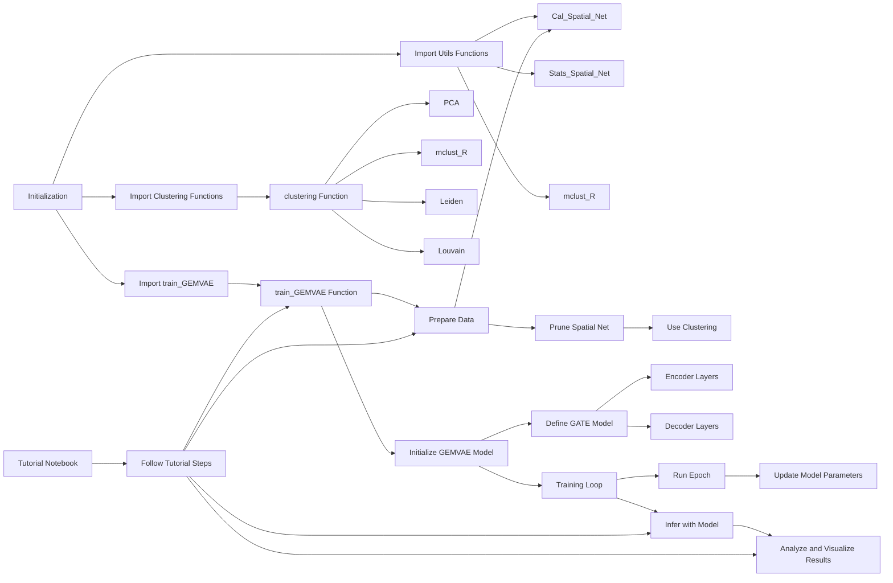

# GemVAE : Graph Enhanced Multi modal Variational Autoencoder


------------------------------------
### To run :

1. Install the package using the command
```
git clone https://github.com/karanwxliaa/GemVAE.git
```
2. Unzip all the datasets in the Data dir
3. Install dependancies
```
pip install requirments.txt
```
4. Run the .ipynb Tutorials 

------------------------------------
### Data
In the /data directory there are several datasets present in the zipped format which need to be extracted before running.

------------------------------------
### Flow Diagram Representation

------------------------------------
### Results
Spatial Multo-Omic clustering of 
1. Stereo SiteSeq dataset
2. Landau Spots dataset


------------------------------------
### Tutorials 
Tutorial_Landau_BC = Landau Spots Breast Cancer <br>
Tutorial_Landau_SR1 = Landau Spots Spleen Rep 1 <br>
Tutorial_Landau_SR2 = Landau Spots Spleen Rep 2 <br>
Tutorial_Spatial_SC = Landau Spatial Cite Seq <br>
Tutorial_SSC_MT = Stereo Cite Seq Mouse Thymus <br>
Tutorial_Generated_data = Generated data

------------------------------------
### Code Explination:
Based on the code files you've provided for the GemVAE package and the tutorial notebook, I will outline the flow of the code and its components, which will then be represented in a mermaid flowchart.

### Code Components and Flow Overview

1. **Initialization (`__init__.py`)**:
   - Initializes the package by importing the main components: `train_GEMVAE`, various clustering methods, and utility functions like `Cal_Spatial_Net`, `Stats_Spatial_Net`, etc.

2. **Utility Functions (`utils.py`)**:
   - Contains functions to calculate spatial networks, perform clustering using mclust from R, and plot weight values. It serves as support for preprocessing and analysis tasks.

3. **Clustering (`clustering.py`)**:
   - Implements functions for spatial clustering, leveraging methods like mclust, leiden, and louvain for identifying cell clusters based on spatial and expression data.

4. **Model Definition (`model.py`)**:
   - Defines the GATE model, which is a core part of GEMVAE, including encoder and decoder parts for genes and proteins, graph attention layers, and the variational autoencoder logic.

5. **GEMVAE Core (`GEMVAE.py`)**:
   - Implements the GEMVAE class, orchestrating the model's training process, including setting up the placeholders, building the model, running epochs, and inferring results.

6. **Training Script (`Train_GEMVAE.py`)**:
   - Provides a high-level interface to train the GEMVAE model on given data, handling data preparation, model initialization, training, and output processing.

7. **Tutorial Notebook (`Tutorial_Landau_SR1.ipynb`)**:
   - A Jupyter notebook demonstrating how to use GemVAE for a specific dataset, likely guiding the user through data loading, model training, and analysis of results.


